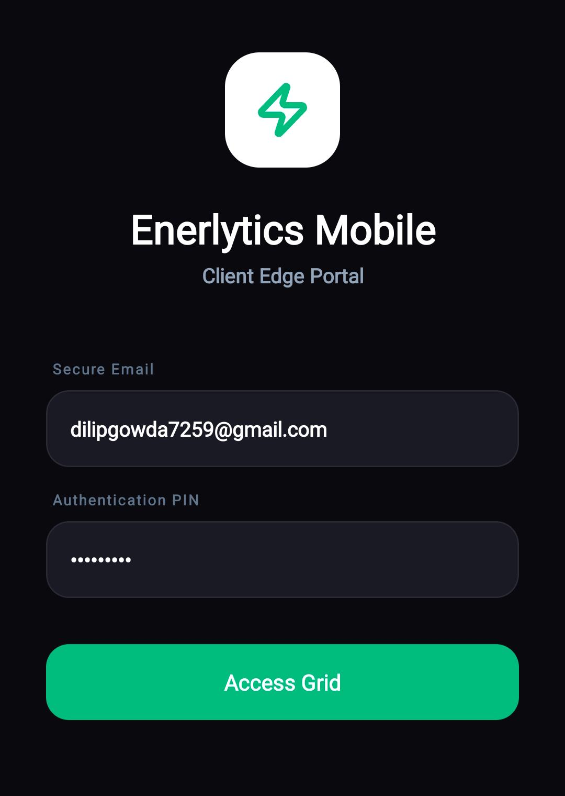
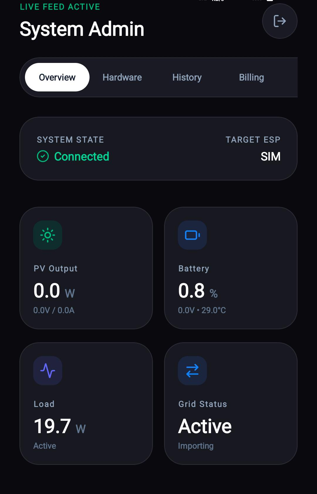
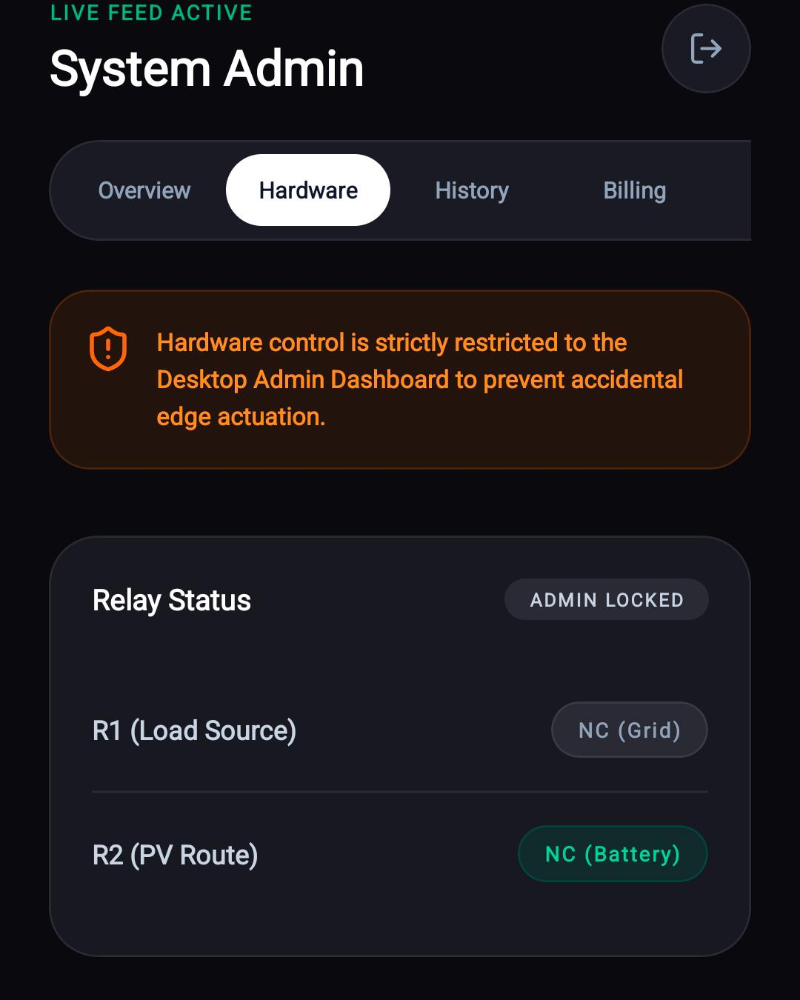
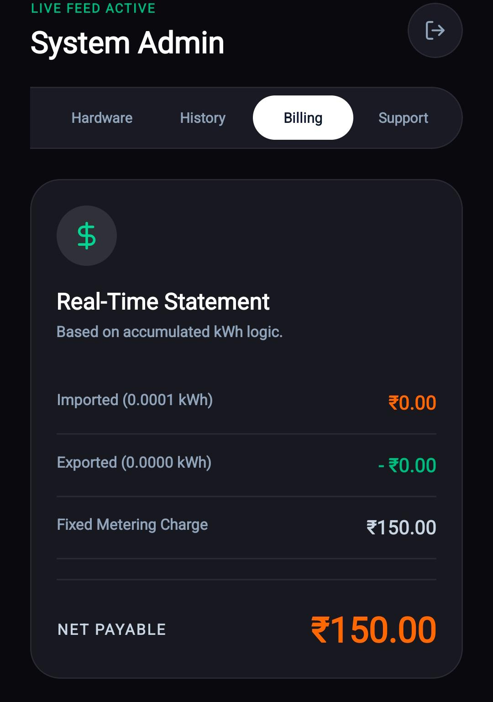

# 🌞 Solar Enerlytics Mobile App

A smart IoT-enabled mobile application designed for real-time solar power monitoring, intelligent battery management, and smart grid interaction. The application communicates with ESP32-based hardware systems and visualizes live energy analytics using a modern React Native interface.

---

## 🚀 Features

- 📡 Real-time solar energy monitoring
- 🔋 Battery charge and health tracking
- ⚡ Grid import/export status monitoring
- 📊 Live historical data logging
- 💰 Smart billing calculations
- 🛡️ Anti-islanding protection system
- ☁️ Supabase real-time synchronization
- 📱 Modern dark-themed mobile UI
- 🔐 Authentication and role-based access
- 🧪 Built-in simulator mode for testing

---

## 🛠️ Technologies Used

- React Native
- Expo
- Supabase
- ESP32
- JavaScript
- IoT Sensors
- Real-Time Database
- Lucide React Native Icons

---

# 📂 Project Structure

```bash
solar-enerlytics-app/
│
├── .expo/
├── assets/
├── dist/
├── node_modules/
│
├── .gitignore
├── App.js
├── app.json
├── eas.json
├── index.js
├── package.json
├── package-lock.json
│
└── README.md
```

---

## ⚙️ Installation

### 1️⃣ Clone Repository

```bash
git clone https://github.com/your-username/SolarEnerlyticsMobileApp.git
```

### 2️⃣ Open Project Folder

```bash
cd solar-enerlytics-app
```

### 3️⃣ Install Dependencies

```bash
npm install
```

### 4️⃣ Start Expo Development Server

```bash
npx expo start
```

---

## 📦 Dependencies

```json
{
  "dependencies": {
    "@supabase/supabase-js": "^2.x",
    "expo": "~latest",
    "lucide-react-native": "^0.x",
    "react": "18.x",
    "react-native": "0.x",
    "react-native-url-polyfill": "^2.x"
  }
}
```

---

## 🔐 Supabase Integration

The app uses Supabase for:

- User Authentication
- Real-Time Database Updates
- Device Monitoring
- Historical Data Logging
- Cloud Synchronization

Update credentials in `App.js`:

```javascript
const SUPABASE_URL = "YOUR_SUPABASE_URL";
const SUPABASE_KEY = "YOUR_SUPABASE_ANON_KEY";
```

---

## 📱 Main Functional Modules

### 🌞 Overview Dashboard

Displays:

- Solar Power Output
- Battery Percentage
- Grid Status
- Load Consumption

### ⚙️ Hardware Monitoring

- Relay Status Visualization
- Grid Isolation Alerts
- Anti-Islanding Monitoring

### 📊 History Logs

- Real-time data storage
- Filtered analytics
- Battery trend monitoring

### 💰 Billing System

- Import/Export calculations
- Net payable estimation
- Dynamic tariff calculations

### 🆘 Support Module

- Admin information
- Technical support details
- Emergency maintenance contact

---

## 🔌 Hardware Setup

Integrated with:

- ESP32 Microcontroller
- Solar Panels
- Battery Systems
- Relay Modules
- Voltage Sensors
- Current Sensors

The ESP32 continuously uploads live data to Supabase, which is visualized inside the mobile application.

---

## 🧠 Smart System Features

- Live database subscriptions
- Real-time synchronization
- Automatic history generation
- Battery charge/discharge simulation
- Grid failure protection
- Automatic anti-islanding logic

---

## 📸 Screenshots

### 🔐 Login Screen



---

### 🌞 Dashboard



---
### 🌞 Hardware Setup



---

### 📊 History Logs


---

### 💰 Billing System



---

## 🌐 Future Enhancements

- AI-based solar prediction
- Weather forecast integration
- Push notifications
- Multi-device management
- Offline mode support
- Advanced analytics dashboard

---

## 👨‍💻 Developed By

### Solar Enerlytics Team

- Dilip Kumar A N
- Arya B V

---

## 🌍 Academic Purpose

This project is developed for:

- Smart energy management
- IoT research and development
- Renewable energy monitoring
- Academic and educational purposes

---

# 📄 License

Developed and maintained by the Solar Enerlytics Team.

All rights reserved.

This project is intended for academic and educational purposes only.
